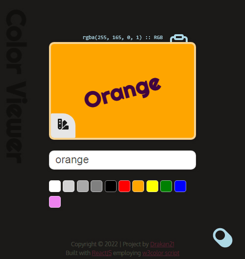

# Color Viewer (ReactJS/HTML/CSS)

Simple Color Viewer application

## Table of contents

-   [Overview](#overview)
    -   [Functionality](#functions)
    -   [Screenshot](#screenshot)
    -   [Links](#links)
-   [My process](#my-process)
    -   [Built with](#built-with)
    -   [What I learned](#what-i-learned)
    -   [Continued development](#continued-development)
    -   [Useful resources](#useful-resources)
-   [Author](#author)
-   [Acknowledgments](#acknowledgments)

## Overview

### Functionality Provided

-   Users may enter a color name, rgb, hsl, hex value
-   Application displays color by name (if it exists by an alias) or simply the entered value as a hexidecimal.
-   Save current color to palette (max of 20 colors)
-   Allows the copying of said values to the clipboard for use elsewhere.
-   Allows switching between light/dark modes for better color viewing.

### Screenshot

### Links

-   Solution URL: [gitHub](https://github.com/Drakan21/ColorViewer)

## My process

### Built with

-   ReactJS
-   HTML/CSS

### What I learned

-   Basic ReacJS implementations for components and states.

### Continued development

-   Add Storage (Local/Session) for color palettes
-   Could add some features for further color utility
    -- contrasting colors
    -- complimentary colors
    -- etc...

### Useful resources

-   [Dave Gray](https://www.youtube.com/watch?v=RVFAyFWO4go&t=10363s) - Fastastic learning materials.
-   [ReactJS](https://reactjs.org/docs) - React JS Documentation for reference.
-   [W3Schools Colors Converter Script](https://www.w3schools.com/colors/colors_converter.asp) - w3Schools script for looking up and converting colors to their respective values (name/rgba/hsl/hex, etc)
-   [cdnj Font Awesome](https://cdnjs.com/libraries/font-awesome) - Icons, etc.
-   [Google Fonts](https://fonts.google.com) - Fonts

## Author

-   Twitter - [@drakanion](https://www.twitter.com/drakanion)
-   GitHub - [Drakan21/GitHub](https://github.com/Drakan21)
